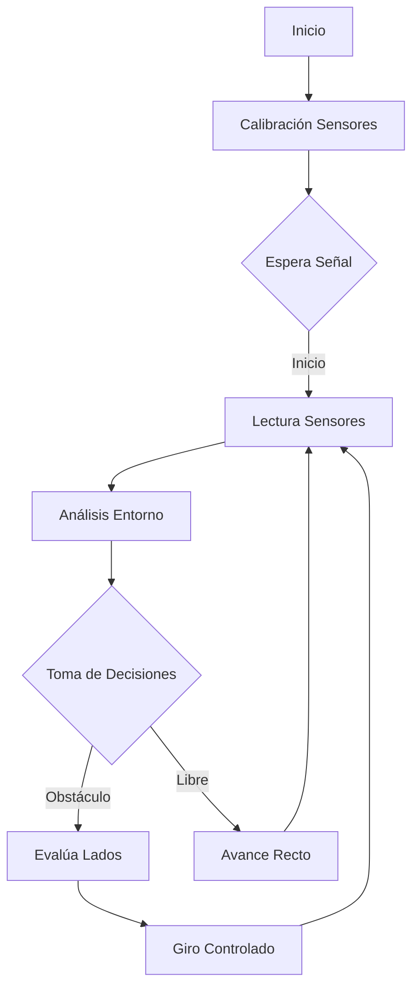

# Documento de ingeniería / Red Machine 

Este repositorio contiene todos los materiales necesarios para crear a "pompo", el robot autonomo creado por el equipo "Red Machine", con el objetivo de participar en la categoría de Futuros Ingenieros en las diferentes etapas de la WRO Venezuela, en su edición 2025. 


# ÍNDICE - REDMACHINE 2025

## 📌 CONTENIDO PRINCIPAL
1. [Documento de ingeniería / Red Machine](#documento-de-ingeniería--red-machine)
2. [Miembros del equipo](#miembros-del-equipo-red-machine)
   - [Samuel José Galban Franco](#-samuel-josé-galban-franco)
   - [Juan Diego Cano Barros](#-juan-diego-cano-barros)
   - [Angel Saul Rodriguez Guerra](#-angel-saul-rodriguez-guerra)
3. [Fotos del robot](#fotos-del-robot-todos-los-ángulos)
4. [Diseño mecánico](#diseño-mecánico)
   - [Guía de Ensamblaje Mecánico](#-guía-de-ensamblaje-mecánico--red-machine)
   - [Estructura General](#-estructura-general-de-doble-piso)
   - [Sistema de Tracción](#-módulo-de-tracción-y-dirección--red-machine)
5. [Componentes electrónicos](#componentes-electrónicos)
   - [Descripción de Componentes](#-descripción-de-componentes-principales-del-sistema)
   - [Diagramas de Conexión](#explicación-del-diagrama-)
6. [Alimentación del robot](#alimentación-del-robot)
   - [Cálculo de Consumo](#-cálculo-del-consumo-energético-total)
7. [Procesamiento de imágenes](#procesamiento-de-imágenes)
   - [Detección de color](#detección-de-color)
8. [Cómo ejecutar o probar el proyecto](#cómo-ejecutar-o-probar-el-proyecto)
9. [Explicación Código Reto 2](#explicacion-codigo-reto-2)
10. [Explicación Reto 1](#explicacion-reto-1)
11. [Videos del funcionamiento](#videos-del-funcionamiento-de-pompo)
    - [Reto 1](https://youtu.be/I5WXGXlZpG4?si=D2IsjQdoafDccQmA)
    - [Reto 2](https://youtu.be/XvPb05R_A2o?si=kEyuvRi_PKU7EDct)
12. [Troubleshooting](#troubleshooting)
13. [Historia y cronología](#historia-y-cronología-de-red-machine)
    - [Temporada 2023](#temporada-2023)
    - [Temporada 2024](#temporada-2024)
    - [Temporada 2025](#temporada-2025)
    - [Evolución de Robots](#julian-luka-y-pompo)

## 📂 ESTRUCTURA DEL REPOSITORIO
- [t-photos/](https://github.com/Samu4035/REDMACHINE-2025/tree/main/t-photos) - Fotos del equipo y competencias
- [v-photos/](https://github.com/Samu4035/REDMACHINE-2025/tree/main/v-photos) - Fotos del vehículo
- [video.md](https://github.com/Samu4035/REDMACHINE-2025/blob/main/video.md) - Enlaces a videos
- [schemes/](https://github.com/Samu4035/REDMACHINE-2025/tree/main/schemes) - Diagramas esquemáticos
- [src/](https://github.com/Samu4035/REDMACHINE-2025/tree/main/src) - Código fuente
- [models/](https://github.com/Samu4035/REDMACHINE-2025/tree/main/models) - Diseños 3D
- [other/](https://github.com/Samu4035/REDMACHINE-2025/tree/main/other) - Archivos adicionales

# Contenido del repositorio

Este repositorio contiene los siguientes directorios para organizar nuestro proyecto:

* `t-photos`: Incluye fotos del equipo, además de fotos del trabajo realizado durante todos los años de competencia y fotos de los robots construidos por el equipo
* `v-photos`: Contiene 6 fotos del vehículo (desde todos los ángulos).
* `video`: Archivo `video.md` con el enlace a los videos de rendimiento del robot.
* `schemes`: Diagramas esquemáticos (JPEG, PNG o PDF) de los componentes electromecánicos, ilustrando la conexión de elementos electrónicos y motores, además de la explicación del funcionamiento de cada uno de estos.
* `src`: Código del software de control para todos los componentes programados para la competición.
* `models`: Archivos para el diseño 3D del vehículo.
* `other`: Archivos adicionales para entender cómo preparar el vehículo para la competición.
     
# Introducción
El equipo ha hecho su mayor esfuerzo para conseguir construir el mejor robot posible. Nuestra preparación para estas olimpiadas se ha basado en un largo aprendizaje en construcción, diseño y programación, y la experiencia de competencias anteriores ha sido fundamental. Largas horas de análisis y estudio de la pista ha llevado a la creación de una estrategia propia, basada en los componentes con los que el equipo deseó trabajar, y esperando conseguir la mejor participación posible en las diversas etapas de esta competencia. 
A lo largo de este documento y de todo el repositorio se explica con precisión todo el trabajo de diseño, programación y construcción del robot. 

# Miembros de Red Machine

## 👤 Samuel José Galban Franco

### Rol en el equipo
Encargado de la electrónica del robot. 

### 🧠 Logros Académicos

- 🥈 **Subcampeón – Olimpiada Nacional de Química (2024)**  
  Representó a el Liceo Los Robles en la última edición de esta competencia organizada por AVOQUIM.

- 🥈 **Subcampeón – VIRTUAL MISSIONS PANAMÁ 2023 CHALLENGE**  
  Segundo puesto en esta competencia internacional, representando a Venezuela durante la final internacional de la WRO 2023, celebrada en Panamá.

---

### 🤖 Trayectoria en Robótica

- 🇻🇪 **Bicampeón Nacional – Categoría Futuros Ingenieros (WRO Venezuela)**  
  Ganador de la Olimpiada Nacional de Robótica en dos ediciones consecutivas, representando al estado Zulia y clasificando a la final internacional.

- 🌍 **Finalista Internacional – WRO Panamá 2023**  
  Representó a Venezuela en la Olimpiada Mundial de Robótica, obteniendo el puesto 25 de 40 equipos en la categoría *Futuros Ingenieros*.

- 🇹🇷 **Participación Internacional – WRO Turquía 2024**  
  Formó parte de la delegación venezolana que compitió en la edición mundial celebrada en Turquía, consolidando su experiencia en escenarios globales de alto nivel.

---

### 💡 Motivación y Enfoque
Conocer Gente, Disfrutar los viajes y buscar oportunidades de estudio


## 👤 Juan Diego Cano Barros

### Rol en el equipo
Encargado de la programación del robot. 

### 🧠 Logros Académicos

- 🥉 **Medalla de Bronce – Olimpiada Iberoamericana de Matemáticas (2023)**  
  Representó a Venezuela en la XXIX edición de esta competencia internacional organizada por la OMA en Argentina, tras ser seleccionado como uno de los 10 mejores del segundo nivel nacional por la @acmvenojm.

- 🥈 **Subcampeón – Olimpiada Matemática Argentina Ñandú (2019)**  
  Participó en la prueba oral en Buenos Aires, destacándose como subcampeón en el nivel 1.

---

### 🤖 Trayectoria en Robótica

- 🇻🇪 **Bicampeón Nacional – Categoría Futuros Ingenieros (WRO Venezuela)**  
  Ganador de la Olimpiada Nacional de Robótica en dos ediciones consecutivas, representando al estado Zulia y clasificando a la final internacional.

- 🌍 **Finalista Internacional – WRO Panamá 2023**  
  Representó a Venezuela en la Olimpiada Mundial de Robótica, obteniendo el puesto 25 de 40 equipos en la categoría *Futuros Ingenieros*.

- 🇹🇷 **Participación Internacional – WRO Turquía 2024**  
  Formó parte de la delegación venezolana que compitió en la edición mundial celebrada en Turquía, consolidando su experiencia en escenarios globales de alto nivel.

---

### 💡 Motivación y Enfoque
Comer, Dormir, Conocer Gente, Disfrutar los viajes y Dormir 


## 👤 Angel Saul Rodriguez Guerra

### Rol en el equipo
Encargado de la mecánica del robot. 

### 🧠 Logros Académicos
- 🥇 Clasificado al Mundial – Olimpiada Mundial de Matemáticas WYMO (2024)
Representó a Venezuela en la World Youth Mathematics Olympiad, una competencia internacional que convoca a jóvenes talentos matemáticos de todo el mundo para enfrentar retos de alta exigencia.
- 🔬 Participante Destacado – Olimpiadas de Química y Matemática en Venezuela
Compitió en distintas ediciones de las Olimpiadas Venezolanas, demostrando excelencia
y pasión por las ciencias exactas desde temprana edad.

--- 

### 🤖 Trayectoria en Robótica
- 🇻🇪 Bicampeón Nacional – Categoría Futuros Ingenieros (WRO Venezuela)
Ganador en dos ediciones consecutivas de la Olimpiada Nacional de Robótica, representando al estado Zulia y obteniendo el pase a competencias internacionales como parte de la delegación nacional.
- 🌍 Finalista Internacional – WRO Panamá 2023
Participó en la Olimpiada Mundial de Robótica celebrada en Panamá, logrando posicionarse en el puesto 25 entre 40 equipos internacionales en la categoría Futuros Ingenieros.
- 🇹🇷 Participación Internacional – WRO Turquía 2024
Integrante de la delegación venezolana que compitió en la edición mundial realizada en Turquía, acumulando experiencia técnica y cultural en entornos de alto nivel competitivo.

--- 

### 💡 Motivación y Enfoque
Apasionado por el aprendizaje continuo, la resolución creativa de problemas y la colaboración en equipos multidisciplinarios. Su trayectoria en competencias académicas y tecnológicas refleja una motivación genuina por generar impacto a través del conocimiento, y por seguir explorando nuevas fronteras del pensamiento científico y la innovación.

---


# Fotos del robot (todos los ángulos)

|   |    |   |
| :----: | :-------------------: | :----------: |
|   |    |   |


# Etapas del desarrollo (Versiones anteriores del robot)


# Sistema Mecánico ⚙

# Version 1.0 (Version desactualizada)

## Dirección

El subsistema de dirección del robot se encuentra en la parte trasera de éste, para así proporcionar un mayor radio de giro, fue creado con piezas de lego de un kit de robótica denominado Kit Lego Spike Prime, uniendo estas piezas con las ruedas de un carro control remoto (RC) modelo Ford Mustang, al cual se le adaptó un servomotor de la marca Rev Robotics. Posteriormente fue programado a través de un arduino mega 2560, conectado el servomotor a los pines GND, 5 V y 4 del Arduino como puede visualizarse en la siguiente imagen.


## Conducción

El subsistema de conducción del robot fue tomado de un  carro a control remoto modelo Ford Mustang. Se utilizó este sistema debido a que portaba un motor y una caja de cambios, y proporcionaba el torque y la velocidad necesaria para el robot. Este funciona con un juego de engranajes, el cual le permite al robot girar a diferentes velocidades sin perder agarre, dicho mecanismo fue ubicado en la parte delantera del robot. El sistema es alimentado a través de un puente H doble modelo L298n por medio de un pack de tres baterías de 3,7 V. 

## Diseño de chasis

La base del chasis fue construida con acrílico, el cual fue cortado y perforado en base a las necesidades del cableado y el ensamblaje de las piezas utilizadas como puede visualizarse en la imagen a la derecha

El robot cuenta con dos pisos ambos construidos con acrílico, tal como se muestra en la imagen anterior. En el “primer piso” del robot fueron ensamblados los sistemas de tracción y dirección, el sensor de ultrasonido, el sensor de color RGB TCS 34725, dos interruptores (uno para el encendido y el otro para iniciar) y el puente H doble modelo L298n; mientras que en el “segundo piso” se encuentra el pack de baterías, la batería de 9 V, la cámara ESP 32-cam, el Arduino mega 2560, y el conector para las baterías. 


## Derecha


## Izquierda


## Delante


## Atras 


## Arriba


## Abajo


# Version 2.0 (Version desactualizada)
Durante este periodo, el diseño del robot siempre fue uno de los mayores problemas que enfrentó el equipo, esto durante todas las fases de la competencia. Las bases de acrílico que se usaron en las primeras competencias no funcionaron, ya que tenían muchas imperfecciones, causando que el sistema de tracción y dirección estuviera mal ubicado, así como una distribución realmente mala. A pesar de todo esto, ese chasis nos dio una idea de cómo diseñar uno nuevo, por lo que después de la competencia nacional 2023, se usaron nuevas bases de acrílico, esta vez cortadas con láser. Después de esto, el chasis se veía realmente bien en todos los aspectos.  


Cambiadas por otras nuevas que se sujetaban mejor al sistema de dirección, lo que también proporcionó mejor estética al robot.  
Después de participar en la Copa Mundial en Panamá, el equipo decidió hacer cambios importantes al crear el nuevo prototipo.  
Entre estos cambios destaca el acercamiento entre las ruedas del sistema de tracción y dirección, con el objetivo de aumentar el radio de giro, permitiendo giros más cerrados. Esto principalmente ayuda al desarrollo del desafío de obstáculos, debido a la dificultad del reto y a la estrategia que el equipo desea usar.  


aproximadamente 5 centímetros, ayudando a que el robot tuviera mayor libertad en el campo de juego, y facilitando el cumplimiento de los retos. Para lograr esto, se rediseñaron los acrílicos, con los nuevos teniendo una estructura completamente diferente a la anterior.  


el sistema de dirección, el cual nuevamente se construyó con piezas Lego, provenientes del kit de robótica Spike Prime número 45678. 3 de estas piezas fueron unidas con un par de ruedas para terminar su construcción.  

De la misma forma, se hizo un diseño 3D, donde pudimos ver y analizar eficientemente todo lo relacionado con el robot.  

## Derecha


## Izquierda


## Front


## Back 


## Above


## Below


> [!note]
> A continuacion se muestras los componentes electronicos agregados durante este periodo

## Motor Core Hex  

> [!tip]
> Fue agregado con el proposito de mejorar la traccion del robot, volviendolo mucho mas consistente en funcion al torque que necesita el robot

> [!warning]
> No fue utilizado en el diseño final debido a la velocidad baja y su gran peso


 JST-VH de 2 pines para la alimentación del motor.  

 


- Peso: 7 onzas  
- Instalación: Para usar este motor de la manera que el equipo lo necesita, se usa un eje hexagonal de 5 mm, del cual un extremo sobresale de cada lado del motor. Dicho eje tiene una longitud de 11.8 cm, y su estructura está hecha de acero inoxidable. En cada extremo de este eje, se colocó una rueda de tracción, cuyo diámetro es de 90 mm. Finalmente, estas ruedas fueron aseguradas al eje con collares, que cuentan con un tornillo de fijación que aprieta hacia el eje.  


especifica a continuación.  
- Torque: 3.2 N-m  
- Voltaje de operación: 12V  
- Velocidad libre: 125 RPM  


## Giroscopio 

Se usa un BNO055 para medir los grados de cada giro y saber cuándo el robot debe parar de girar. El giroscopio se usa tanto para evitar las señales de tránsito como para tomar las curvas.  


- Pines de conexión:  
  Vin  
  3V  
  P50  
  GND  
  PS1  
  SDA  
  INT  
  SCL  
  ADR  
  RST  
El equipo utiliza la entrada Vin para alimentar el sensor, el pin de tierra, y los pines SDA y SCL para establecer comunicación entre el Arduino y el BNO055.  
Salida de datos:  
El BNO055 puede entregar los siguientes datos de sensores:  
- Orientación absoluta (Vector Euler, 100Hz): Datos de orientación en tres ejes basados en una esfera de 360°  
- Orientación absoluta (Cuaternión, 100Hz): Salida cuaternión de cuatro puntos para manipulación más precisa  
- Vector de velocidad angular (100Hz): Tres ejes de ‘velocidad de rotación‘ en rad/s  
- Vector de aceleración (100Hz): Tres ejes de aceleración (gravedad + movimiento lineal) en m/s²  
- Vector de intensidad del campo magnético (20Hz): Tres ejes de detección del campo magnético en micro Tesla (uT)  
- Vector de aceleración lineal (100Hz): Tres ejes de aceleración lineal (aceleración menos la gravedad) en m/s²  
- Vector de gravedad (100Hz): Tres ejes de aceleración gravitacional (menos cualquier movimiento) en m/s²

> [!tip]
> Fue agregado con el proposito de mejorar el movimiento del robot a lo largo de la pista, sabiendo la orientacion exacta a donde ir

> [!warning]
> No fue utilizado en el diseño final debido a ser unicamente un acelerometro, por lo que sufre de problemas de calibracion, el modelo mpu6050 es mucho mas eficiente para esta labor.

# Cámara  
Luka usa una cámara para detectar el color de las señales de tránsito. Esta es la pixy2.  


La pixy2 funciona a 60 fps, y es capaz de detectar objetos, líneas y colores. En Luka, el objetivo principal de la cámara es detectar colores (rojo y verde).  


Está conectada al Arduino con un cable IDC 2 ICSP Arduino que va a los pines ICSP del Arduino, lo cual proporciona todas las conexiones necesarias para alimentar y comunicarse con la pixy. 

> [!tip]
> La pixycam fue utilizada para facilitar en gran medida los cambios que se hacen con los colores de los pilares, la aplicacion pixymon es muy accesible para todo el mundo

> [!warning]
> El consumo energetico de la pixy es muy alto para el arduino, por lo tanto fue una de las razones de agregar tantas baterias


> [!note]
> La alimentacion del robot se mantiene los mismos principios a lo largo de las tres versiones

# Alimentación del robot  
En Luka hay dos sistemas individuales de alimentación.  
## Circuito de 12V  
Este circuito usa 3 baterías, cada una con aproximadamente 4V. Las 3 baterías están conectadas en serie, por lo que el voltaje se suma. El puente H es el componente eléctrico que recibe esta energía y la usa para alimentar dos sensores ultrasónicos y el motor de tracción.  
Para conectar las baterías el equipo utiliza dos paquetes de dos baterías cada uno, pero uno de ellos está modificado para usar sólo una batería.  


## Circuito de 9V  
Este circuito usa 3 baterías de 9V conectadas en paralelo, por lo que la amperaje se suma manteniendo los 9V. Está conectado directamente a la placa Arduino, que alimenta un ultrasonido, la cámara pixy y el servo motor. Cada uno de estos componentes es energizado por un pin de salida de 5V del Arduino.  


# Diagrama de conexiones  
Se muestra el diagrama de conexiones para que todo el circuito pueda verse claramente.  


# Videos Version 1.0 del robot
## Reto 1
[](https://youtu.be/W26b5g69BQQ?si=Y7qg7TaV6iR0McLb)

## Prueba Reto 2
[](https://youtube.com/shorts/cc8yKOo6g8U?si=XeC0w1IYvneSmaU0)


# Videos versión 2.0 del robot  

## Video reto 1 completo, todas las variantes
[
](https://www.youtube.com/watch?v=HS7eLoFSOkU)

## Video reto 2 completo
[
](https://www.youtube.com/watch?v=cjjnRDXaDAU&t=56s)

# Videos sobre el robot
## Muestra de la deteccion de color
[
](https://www.youtube.com/shorts/HLt_O2JlURQ)

## Prueba de continuidad
[](https://www.youtube.com/shorts/jUmZjaQ_be8)
## Presentacion nacional 2023
[](https://www.youtube.com/watch?v=fVg6WCavaBU)
## Red Machine Nacional 2023
[](https://www.youtube.com/watch?v=FSo2NadI6ec&pp=0gcJCbIJAYcqIYzv)
## Presentacion del equipo Red Machin
[](https://www.youtube.com/watch?v=EYFYI9Z96V4&t=25s)
## Robotica Educativa
[](https://www.youtube.com/watch?v=Is-765hQCRY)


# Diseño final del robot | Version 3.0 (version actualizada)
Lo mencionado a partir de este momento del repositorio son las piezas y materiales utilizados para construir las version mas actualizada del robot.

# Diseño mecánico
"Pompo" es un robot autónomo diseñado con piezas de lego, con la finalidad de conseguir la mayor presición y estabilidad posible durante las rondas de competencia. Dichas piezas fueron extraídas de un kit lego spike prime código 45678 y spike prime expansion set código 45681. 
El fundamento que llevó a utilizar piezas de lego para el cuerpo de pompo se basa en la conocida eficiencia de los robots construidos de dicha manera, tomando en cuenta los resultados positivos y la facilidad que permiten a la hora de la construcción. 
Además, en el apartado "v-photos" se muestran fotos del diseño de Pompo, donde se pueden ver y analizar eficientemente todos los componentes, piezas y estructuras, y en la carpeta models se encuentran los archivos orginales de los diagramas 3D.
A continuación se muestras fotos del diseño 3D de las diversas bases de lego que se usan en la estructura (en el apartado "models" se ve el archivo original del diseño): 

| Imagen | Nombre de Componente | Descripción |
| :----: | :-------------------: | :----------: |
|  | Bases de los ultrasonidos | En este conjunto de piezas de lego se colocan y ensamblan los ultrasonidos del robot |
|   | Sistema de tracción y dirección | Se incluye el motor y las bases en las que este se coloca, de forma que quede anclado de forma perfecta como se necesita. Asi mismo en la parte mas alejada del motor se ven las dos bases en las que se sostiene el servomotor, dando base a el sistema de dirección. |
|   | Chasis | Se observa toda la estructura del chasis, incluyendo las bases de las placas, botón de activación, switch, pixycam y más. |

## 🛠 Guía de Ensamblaje Mecánico – Red Machine 
Para comenzar, se construye la estructura del chasis principal. Esta base debe ser resistente y simétrica, ya que soportará el único motor trasero y el servo motor frontal. Es fundamental asegurar ambos componentes con firmeza, cuidando que el motor quede perfectamente alineado para impulsar al robot, mientras que el servo tenga libertad de movimiento para controlar la dirección.
Una vez fijados estos elementos clave, se procede a montar el soporte estructural central que atraviesa el chasis y estabiliza toda la base. Esta parte también sirve como columna vertebral que conecta los laterales y permite mayor rigidez al momento de continuar con la instalación de los niveles superiores.
Con el chasis firme y balanceado, se construye el primer piso del robot. Esta plataforma debe colocarse a una altura adecuada para dar espacio al cableado inferior y servir de base para la instalación de componentes eléctricos. Luego se eleva el segundo piso utilizando separadores estructurales que garanticen una plataforma paralela y estable. Esta segunda planta será la encargada de alojar el Arduino, los botones y demás dispositivos de control.
Finalmente, se revisa toda la estructura para asegurarse de que cada parte esté alineada, nivelada y correctamente sujeta. En este punto se pueden hacer pequeños ajustes para corregir inclinaciones, reforzar uniones y preparar la base para el cableado y montaje de los módulos electrónicos.

### 🧱 Estructura General de Doble Piso
El robot cuenta con una estructura de dos niveles, cada uno con funciones definidas para optimizar la organización, accesibilidad y rendimiento de los componentes:
- Piso Inferior: Aloja los elementos encargados del control de motores y la distribución de energía. Su diseño ofrece estabilidad mecánica y separación eléctrica con los componentes de control.
- Piso Superior: Espacio reservado para la electrónica de comando y los controles principales. Esta configuración permite una mejor ventilación y mayor facilidad para operar el robot de manera segura y eficiente.

🔋 Piso Inferior – Potencia y Control de Movimiento
En la parte inferior del robot se encuentran distribuidos estratégicamente varios elementos esenciales:
- Dos puentes H:
- Uno controla el funcionamiento de los motores, permitiendo gestionar dirección y velocidad.
- El otro está dedicado a la alimentación de los sensores, evitando que las variaciones de voltaje generadas por los motores afecten la precisión en la lectura sensorial.
- Tres portabaterías de 9V:
- Dos baterías alimentan al Arduino, proporcionando energía estable y continua para el procesamiento de datos.
- Una batería alimenta exclusivamente al puente H de sensores, lo que garantiza lecturas más confiables al evitar interferencias o fluctuaciones.
⚙ Esta separación de sistemas de potencia permite una mayor eficiencia, evita interferencias cruzadas y mejora la precisión operativa del robot.


⚙ Piso Superior – Control y Comodidad Operativa
Este nivel está dedicado a los elementos que requieren accesibilidad directa por parte del operador:
- Arduino: Ubicado en una zona elevada y protegida para facilitar conexiones, programación y minimizar vibraciones.
- Portabatería doble (3.7V): Alimenta módulos electrónicos auxiliares. Su posición superior permite fácil cambio y acceso durante mantenimientos.
- Interruptor (switch) de encendido/apagado: Situado estratégicamente para iniciar o detener el robot de manera rápida y segura.
- Botón de inicio: Permite arrancar las rutinas del robot al comenzar la competencia, evitando manipulaciones innecesarias en zonas sensibles.
🛠 La disposición de estos elementos en la parte superior mejora la accesibilidad, favorece la organización de cables y protege los componentes de la acción mecánica del piso inferior.


🎥 Cámara – Visión Elevada y Precisa
En el punto más alto del robot se encuentra montada una cámara, sostenida por dos estructuras verticales que sujetan una pieza gris. Esta configuración se diseñó con los siguientes propósitos:
- Amplitud de visión: Al estar en la parte más alta, la cámara evita interferencias visuales de otros componentes del robot.
- Aislamiento del entorno: Su altura permite reducir la influencia de luces externas, reflejos o sombras del campo de competencia.
- Estabilidad estructural: La fijación rígida de sus soportes garantiza que no haya vibraciones ni desplazamientos que comprometan la calidad visual durante la ejecución.

### 🏎 Módulo de Tracción y Dirección – Red Machine

⚙ Estructura de Soporte de Motores

La estructura que se observa en la imagen está diseñada con el objetivo de fijar los motores de manera estable y eficiente:

- Montaje rígido: Los motores se encuentran anclados sobre una base firme construida con piezas LEGO, garantizando que no haya desplazamientos ni vibraciones durante la operación.

- Orientación óptima: La posición en que están colocados favorece una tracción precisa y directa, permitiendo transmitir la potencia mecánica sin pérdidas ni desviaciones.

- Distribución de peso equilibrada: Al estar los motores cerca del eje trasero, el centro de gravedad se mantiene bajo, lo que mejora la estabilidad en curvas y maniobras rápidas.

🚗 Sistema de Tracción Trasera

El robot implementa una configuración de tracción trasera, donde los motores impulsan directamente las ruedas posteriores:

- Ventajas mecánicas: Este tipo de tracción proporciona mayor empuje y control especialmente útil en desplazamientos rectos y al subir pendientes.

- Simplicidad y eficacia: La conexión directa entre motores y ruedas traseras reduce el uso de engranajes adicionales, lo que disminuye la fricción y mejora la eficiencia energética.

🔄 Dirección Frontal con Servo

En la parte delantera del chasis se encuentra instalado un servo motor que actúa como mecanismo de dirección:

- Control de orientación: El servo está conectado a las ruedas delanteras mediante un sistema de brazos articulados que permite modificar el ángulo de dirección.

- Precisión milimétrica: Al tratarse de un servo, las variaciones de ángulo son controladas digitalmente, permitiendo maniobras suaves, curvas cerradas y correcciones durante el trayecto.

- Separación funcional: La dirección independiente de la tracción mejora el comportamiento dinámico del robot y permite algoritmos de navegación más avanzados.

🧭 Soporte Central de Sensores Ultrasónicos Laterales
Este componente se encarga de sostener dos sensores ultrasónicos, ubicados a ambos lados del robot y perfectamente integrados en la estructura general.

🧱 Diseño Integrado en el Chasis
- Unión física con el cuerpo principal: Aunque su diseño sugiere modularidad, el soporte está firmemente unido a la estructura central del robot, colocándose justo en la zona media del chasis para lograr un equilibrio funcional y estructural.
- Anclaje estratégico: La ubicación central permite que la pieza se mantenga firme durante el movimiento, evitando desplazamientos o vibraciones no deseadas que afecten la precisión de los sensores.
🎯 Posicionamiento Lateral de los Sensores
- Distribución simétrica: Los sensores ultrasónicos están colocados en ambos extremos del soporte, orientados hacia los lados, lo que mejora la cobertura horizontal del entorno del robot.
- Lecturas precisas: Esta configuración permite detectar obstáculos laterales, alinearse con paredes o identificar zonas estrechas durante la navegación con mayor exactitud.
- Protección y visibilidad: Al estar elevados y centrados, los sensores tienen un campo de visión despejado, libre de interferencias visuales por otras piezas.


# Cálculo de Torque Necesario para Mover el Vehículo:
El torque necesario (T) se calcula mediante la fórmula: T=m⋅g⋅r
Donde:

m = masa del vehículo (1.02 kg)

g = gravedad (9.81 m/s2)

r = radio de las ruedas (0.02 m)

T=0.870⋅9.81⋅0.03=0.17 N⋅m

Cálculo de Torque a la Salida (después de la reducción) según el motor DC 25GA370:

Tsalida=Tmotor⋅Reducción Tsalida=0.2⋅1 = 0.2>0.17=T


## Cálculo de velocidad angular (ω) y velocidad lineal (v)
La velocidad de salida después de la reducción es 220.2 RPM. Convertimos esto a radianes por segundo:

ω=220.2×2π60≈23.04 rad/s

ω=220.2×

60

2π
​
≈23.04 rad/s

La velocidad lineal del vehículo se calcula multiplicando la velocidad angular por el radio de la rueda 

v=ω×r=23.04×0.03≈0.69 m/s

v=ω×r=23.04×0.03≈0.69 m/s


Especificaciones del motor LEGO y reducción

Velocidad sin carga: 170 RPM

Torque nominal: 0.20 kg·cm (≈ 0.0196 N·m)

Relación de reducción: 21.3:1

Efectos de la reducción:

Velocidad reducida en el eje de salida:

170 RPM×21.3≈7.98 RPM

Fuerza necesaria para mover el robot (870 g ≈ 8.53 N)

Suponiendo un coeficiente de fricción típico (μ ≈ 0.4) en una superficie normal:

Fuerza mıˊnima=μ×m×g=0.4×0.87 kg×9.81≈3.41 N

Fuerza m= nima=μ×m×g=0.4×0.87 kg×9.81≈3.41 N

El torque disponible en las ruedas (0.4175 N·m) es muy superior al mínimo requerido (0.102 N·m), por lo que el robot se moverá sin problemas.

Velocidad lineal: ≈ 0.69 m/s (con ruedas de 3 cm de radio).

Torque en ruedas: ≈ 0.4175 N·m (suficiente para superar la resistencia al movimiento).

El sistema cumple con los requisitos de tracción y movilidad.


### 📦 Descripción de motores del Sistema

| Imagen | Nombre de Componente | Descripción |
| :----: | :-------------------: | :----------: |
|  | **Servo motor de Rev Robotics** | Es un motor eléctrico con sensor de retroalimentación de posición integrado, que permite realizar movimientos angulares perfectos, utilizando una señal que va de 0V a 5V, donde cada valor que pueda tener el voltaje representa un ángulo exacto, cumpliendo con excelencia la función de realizar los giros. |
|  | **Motor lego ev3** | Dispositivo que convierte la energía eléctrica en movimiento mecánico, permitiendo en este caso mover una caja de cambios y movilizar las ruedas. La velocidad y el par que tiene vienen determinados por la tensión enviada a través del puente en H, siendo moderados por el Arduino. |

En la siguiente imagen se puede observar el diagrama de conecciones y alimentación de los mencionados componentes: 


### Explicación del diagrama 

- El motor de tracción (motor grande ev3) se encuentra conectado a los puertos de motor 1 del puente H. Para esto, se utiliza un cable de ev3 modificado, el cual fue cortado en un extremo de manera muy cuidadosa buscando no dañar los 4 cables internos. De estos 4 cables se toman el positivo y el negativo, los cuales se acoplan al puente H.
- El servomotor es alimentado directamente por el arduino, a través de los puertos 5V y GND, y se conecta al pin 9 para recibir señales de posicionamiento.
- El arduino mega es alimentado por dos baterías de 9V conectadas en paralelo, es decir, dos baterías en las que se unen los puerto negativos por un lado y los positivos por otro, para que se sume el amperaje y se mantenga el voltaje.
- El puente H se conecta al arduino por un puerto GND para formar el puente, además de los pines 5, 6 y 7 para controlar el sentido de dirección del robot y la velocidad en la que este opera. 

## Componentes electrónicos 
A pesar de que la construcción del robot fue hecha con piezas de lego, para todo el apartado electrónico el equipo se decidió por utilizar piezas externas con las que ya se han familiarizado. Entre estas se encuentran los siguientes sensores y actuadores:

### 📦 Descripción de Componentes Principales del Sistema

| Imagen | Nombre de Componente         | Descripción |
|:------:|:----------------------------:|:------------|
|  | **Sensor ultrasónico (HC-SR04)** | Utiliza ondas ultrasónicas para medir la distancia a obstáculos. El Arduino Mega 2560 calcula la distancia en base al tiempo que tarda la onda en ir y volver, permitiendo que el robot detecte paredes y realice giros cuando sea necesario. |
|  | **Sensor giroscopio (MPU6050)** | Mide la orientación del robot en grados. Permite mantener trayectorias rectas y ejecutar giros precisos, especialmente en transiciones de secciones como curvas de 90°. |
|  | **Cámara Pixy 2.1** | Detecta colores específicos preconfigurados que representan señales o zonas de tráfico. Reconoce patrones de color en la imagen y transmite datos al Arduino para ejecutar maniobras de evasión o reacción automática. |
|  | **Arduino Mega 2560** | Microcontrolador ATmega2560 que actúa como cerebro central del sistema. Procesa información proveniente de sensores, ejecuta el control de motores y gestiona las decisiones lógicas del robot. Dispone de múltiples pines digitales y analógicos, ideales para proyectos complejos. |
|  | **Módulo Puente-H (L298N)** | Permite controlar la dirección y velocidad de motores de corriente continua. Recibe señales del Arduino y regula la tensión de salida, habilitando el cambio de giro y la aceleración del motor según lo requiera el algoritmo de control. |

En la siguiente imagen se observa el diagrama de conecciones de esos componentes: 


### Explicación del diagrama 

- Los 3 ultrasonidos se encuentran unidos al arduino por pines digitales, de la siguiente forma: (Ultrasonido izquierdo: Pin 30 echo, 31 trig; Ultrasonido central: Pin 20 echo, 19 trig; Ultrasonido derecho: Pin 12 echo, 11 trig). Se alimentan a través del puerto 5V del puente H, y su conección a tierra es la del puente H.
- El giroscopio se une a los puertos SCL y SDA (20 y 21) del arduino, y se alimenta de igual forma que los ultrasonidos, por los puertos del puente H.
- La pixycam se une al arduino por el cable que esta incluye, conectándose al puerto ICSP del arduino. Se alimenta por esta conección. 
- El arduino mega es alimentado por dos baterías de 9V conectadas en paralelo, es decir, dos baterías en las que se unen los puerto negativos por un lado y los positivos por otro, para que se sume el amperaje y se mantenga el voltaje.
- El puente H se conecta al arduino por un puerto GND para formar el puente. Se alimenta por una batería 9V, y le da energía a todos los sensores.
- El pulsador se une a los pines 22 y 23 del arduino, y al presionarse se inicia el código del robot, comenzando el reto.

> ⚠️ *Nota:* En el diagrama se observan dos interruptores, sin embargo estos representan un único interruptor doble, el cual al accionarse, enciende ambos circuitos. Se coloca de esta forma por la facilidad de explicar el diagrama.
---

# Alimentación del robot

La alimentación de nuestro robot se separa en 3 partes: 
- Alimentación del arduino: Dos baterías de 9V recargables conectadas en paralelo (se unen los cables negativos por un lado y los positivos por otro lado).
- Alimentación de sensores: A través de un puente H, se conecta una batería de 9V recargable que alimenta a todos los sensores del sistema.
- Alimentación de motores: Se conectan dos baterías de 3.7V en paralelo (se conecta un cable negativo con uno positivo, dejando los otros dos libres) a un segundo puente H, al cual se conecta el motor de tracción (motor grande EV3).

Estos sistemas se unen a través de un interruptor. 

### 🔋 Cálculo del Consumo Energético Total

| Componente                      | Cantidad | Consumo estimado (mA) | Total (mA) |
|--------------------------------|----------|------------------------|------------|
| Motor grande LEGO EV3          | 1        | 250 mA (típico)        | 250 mA     |
| Servo motor REV Robotics       | 1        | 180 mA (típico)        | 180 mA     |
| Sensor ultrasónico HC-SR04     | 3        | 15 mA c/u              | 45 mA      |
| PixyCam (CMUcam5)              | 1        | 140 mA                 | 140 mA     |
| Sensor MPU6050                 | 1        | 6 mA                   | 6 mA       |
| **TOTAL**                      | —        | —                      | **621 mA** |

---

### ⚡ Distribución de Energía y Estimación de Autonomía

El sistema se alimenta de forma distribuida para mejorar la eficiencia y facilitar la gestión energética:

- 🔌 **2 baterías de 9V**: Alimentan el Arduino y el servo motor.
- 🔋 **1 batería de 9V**: Suministra energía a todos los sensores (ultrasónicos, MPU6050, PixyCam).
- 🔋 **2 baterías 18650 (3.7V, 2000 mAh c/u, conectadas en serie para 7.4V)**: Alimentan el motor grande EV3.

| Fuente de Energía            | Componentes Alimentados           | Consumo estimado (mA) | Capacidad Aprox. | Autonomía Estimada |
|------------------------------|------------------------------------|------------------------|------------------|---------------------|
| 2x 9V                        | Arduino + Servo REV                | ~230 mA               | ~500 mAh         | ~2 horas            |
| 1x 9V                        | Sensores (PixyCam, HC-SR04, MPU)   | ~191 mA               | ~500 mAh         | ~2.6 horas          |
| 2x 18650 (7.4V, 4000 mAh)    | Motor grande EV3                   | ~250 mA               | 4000 mAh         | ~16 horas           |

> 💡 *Nota: Los valores de autonomía son teóricos y pueden variar según condiciones reales como carga del motor, procesamiento visual o intensidad de uso de sensores.*
> 


# Procesamiento de imágenes
Para procesar la imagen, pompo utiliza una cámara. Esta es la pixy2. 


La pixy2 trabaja a 60 fps, y es capaz de detectar objetos, líneas y colores. En pompo el objetivo principal de la camara es detectar colores (rojo y verde). 
Se conecta al arduino con un cable IDC 2 ICSP Arduino que va en los pines ICSP del arduino, que proporciona todas las conexiones necesarias para alimentar y comunicarse con el pixy. 

## Detección de color
Pixy2 utiliza un algoritmo de filtrado basado en el color para detectar objetos llamado el algoritmo Color Connected Components (CCC). Pixy2 calcula el color (tono) y la saturación de cada píxel RGB del sensor de imagen y los utiliza como parámetros principales de filtrado. El tono de un objeto permanece prácticamente inalterado con los cambios de iluminación y exposición. El algoritmo CCC de Pixy2 recuerda hasta 7 firmas de color diferentes.

Después de guardar un color en una firma de color, el pixy lo añadirá a una tabla de objetos que está rastreando actualmente y le asignará un índice de rastreo. A continuación, intentará encontrar el objeto (y todos los objetos de la tabla) en el siguiente fotograma buscando su mejor coincidencia. Cada objeto rastreado recibe un índice entre 0 y 255 que mantendrá hasta que abandone el campo de visión de Pixy2. 


## Programación 
Para establecer los colores que debe detectar la cámara, el equipo utiliza pixymon. PixyMon es una aplicación que funciona en Windows, MacOs y Linux. Te permite ver lo que Pixy2 ve, ya sea como vídeo en bruto o procesado. También te permite configurar tu Pixy2, establecer el puerto de salida y gestionar las firmas de color. PixyMon se comunica con Pixy2 a través de un cable mini USB estándar.


En pixymon el equipo establece 6 firmas, tres para el verde y tres para el rojo. Las firmas 1, 3 y 5 para el rojo, y las firmas 2, 4 y 6 para el verde. 

Después de esto el arduino proccesing necesitaba ser hecho. 

En el arduino, el equipo utiliza la librería pixy2, que permite obtener toda la información necesaria de la detección de pixeles. Entonces, usando el siguiente código, el equipo guarda cuando el pixy detecta un color y a qué firmas corresponde el color en una variable llamada «hola». Si hola es divisible por dos, entonces el color es verde, y si hola no es divisible por dos, entonces el color es rojo. 


# Cómo ejecutar o probar el proyecto  
Para ejecutar un código en una placa Arduino Mega, lo primero es instalar el Arduino IDE en tu equipo si aún no lo tienes. Conecta la placa mediante un cable USB tipo B y, dentro del IDE, selecciona la opción "Arduino Mega or Mega 2560" en el menú “Herramientas > Placa”. Luego, elige el puerto correspondiente en “Herramientas > Puerto” para establecer comunicación. Posterior a eso, copiar y pegar los códigos en este repositorio de GitHub, puedes descargar los archivos desde allí y abrirlos directamente en el entorno.


Después de abrir el código del proyecto (como el de REDMACHINE-2025), verifica que no haya errores usando el botón de compilación (✓) en el IDE. Una vez validado, presiona el botón de carga (→) para subir el programa a la placa Arduino Mega. Este proceso transfiere el código al microcontrolador, que empezará a ejecutarlo automáticamente. Dado que el Mega ofrece mayor capacidad de entrada/salida y memoria que otras placas, es ideal para proyectos exigentes como el alojado en dicho repositorio.


Una vez cargado el programa, puedes utilizar el Monitor Serial del IDE para observar el comportamiento del sistema en tiempo real, interpretar los mensajes enviados desde el código y comprobar que las funciones se están ejecutando correctamente. 


# Codigo Reto 2

---

## 1. Inicialización y Configuración

- Calibración del IMU (MPU6050)  
- Configuración de pines y comunicación (Serial, I²C, servo, motores, botón)  
- Centrado del servomotor de dirección (`rec`)  
- Espera de señal de inicio (botón en pin 23 o comando serial `'1'`)

---

## 2. Secuencia Principal de Operación (loop)

El robot repite continuamente el siguiente ciclo:

### a) Lectura de Sensores


- Ultrasonidos izquierdo (`di`), central (`d`) y derecho (`dd`)  
- Actualización de ángulo con IMU (`gyro`)

### b) Detección de Obstáculos Cercanos

**Función**: `detectarladocorto()`

- Si `d < 10 cm`:  
  - Relee distancias  
  - Compara `di` vs. `dd`  
  - Asigna lateralidad:  
    - `a = 1` → giro por la izquierda  
    - `a = 2` → giro por la derecha  

### c) Gestión del Segundo Reto (girosegundoreto())

Cuando `d < 10 cm` detecta pared frontal:

| Carril | Secuencia de Maniobra                                                                                         |
| ------ | -------------------------------------------------------------------------------------------------------------- |
| Impar  | 1. Retroceder<br/>2. Girar 90° opuesto a la pared<br/>3. Retroceder 2.5 s<br/>4. Avanzar                       |
| Par    | 1. Retroceder 1.8 s<br/>2. Girar 90° hacia la pared<br/>3. Retroceder 2.5 s<br/>4. Avanzar                     |

Al final de cada reto, `vuelta++`.

### d) Detección de Conos (detectarpixyY())

- La cámara Pixy2 captura bloques de color.  
- Identifica firma de color:  
  - Rojo si `signature % 2 == 1`  
  - Verde si `signature % 2 == 0`  
- Selecciona el bloque más cercano (mayor `m_y`).  
- Conserva `lastblock` si la detección momentánea falla.

### e) Evasión de Conos


**Función**: `esquivarconos()`

- Según `a` (lado) y `carril` actual, realiza maniobras:  
  - Cono rojo en carril 0 →  
    1. `giroderf(45)`  
    2. Servo a posición neutra + delay  
    3. `giroizqf(45)`  
    4. Actualiza `carril` y `listo`  
  - Lógicas análogas para conos verdes y otros carriles

### f) Control de Dirección

- **Navegación recta** (`rectificadosolo(target)`):  
  - Ajusta servo con control proporcional (PID)  
  - Mantiene ángulo objetivo `angulof`  
- **Giros precisos** (`giroizqf()`, `giroizq90()`):  
  - Calculan `angulof = gyro + Δ°`  
  - Corrigen en bucle hasta error < 2°  
  - Detienen servo en posición neutra

---

## 3. Mecanismos Clave de Control

### 3.1 Sistema de Carriles

| Carril | Comportamiento                              |
| ------ | ------------------------------------------- |
| 0      | Búsqueda del primer cono                   |
| 1      | Tras esquivar cono rojo desde la derecha    |
| 2      | Tras esquivar cono verde desde la derecha   |
| 3      | Tras esquivar segundo cono rojo             |
| 4      | Tras esquivar segundo cono verde            |

### 3.2 Lógica de Evasión

- **Conos rojos**  
  - 1ª detección: esquivado suave (45°)  
  - 2ª detección: maniobra pronunciada (80°)  
- **Conos verdes**  
  - Maniobra en sentido opuesto a los rojos  
  - Actualiza carril según color

---

## 4. Gestión de Movimiento


- **Avanzar**: motor frontal activado  
- **Retroceder**: motor trasero activado  
- **Girar**: comando mixto servomotor + marcha  
- **Detenido**: ambos motores desactivados  

---

## 5. Estrategia de Navegación


> 💡 *Nota: Los indicadores de abajo representan el nivel de confiabilidad que tiene el robot para hacer estas partes*

Este sistema permite al robot:

- Navegar en la pista de Futuros Ingenieros 
- Identificar y esquivar los semaforos  
- Mantener orientación precisa con IMU  
- Adaptar comportamiento según cualquier incoveniente  
- Completar circuitos de manera segura 

# Explicacion Reto 1

## 🌐 **Diagrama de Flujo Principal**  


> ⚠️ *Nota:* Las funciones utilizadas en el reto 2 son las mismas que en el reto 1, por lo tanto tanto la explicacion como el razonamiento mencionado previamente es igual de efectivo.


### 🧪 Registro de Pruebas – Primer Reto

| #  | ¿Lo logró?   | Tiempo (s) | Error Detectado                            |
|----|--------------|------------|---------------------------------------------|
| 1  | Sí           | 118        | Ninguno                                     |
| 2  | Sí           | 121        | Ninguno                                     |
| 3  | No           | 10         | Detección incorrecta del lado de inicio     |
| 4  | Sí           | 119        | Ninguno                                     |
| 5  | Sí           | 117        | Ninguno                                     |
| 6  | Sí           | 122        | Ninguno                                     |
| 7  | Sí           | 120        | Ninguno                                     |
| 8  | No           | 10         | Detección incorrecta del lado de inicio     |
| 9  | Sí           | 118        | Ninguno                                     |
|10  | Sí           | 123        | Ninguno                                     |
|11  | Sí           | 120        | Ninguno                                     |
|12  | Sí           | 119        | Ninguno                                     |
|13  | No           | 10         | Detección incorrecta del lado de inicio     |
|14  | Sí           | 118        | Ninguno                                     |
|15  | Sí           | 120        | Ninguno                                     |
|16  | No           | 10         | Detección incorrecta del lado de inicio     |
|17  | Sí           | 117        | Ninguno                                     |
|18  | Sí           | 121        | Ninguno                                     |
|19  | Sí           | 122        | Ninguno                                     |
|20  | No           | 10         | Detección incorrecta del lado de inicio     |
|21  | Sí           | 120        | Ninguno                                     |
|22  | Sí           | 119        | Ninguno                                     |
|23  | Sí           | 118        | Ninguno                                     |
|24  | Sí           | 121        | Ninguno                                     |
|25  | No           | 10         | Detección incorrecta del lado de inicio     |
  

Tiempo promedio de recorrido, precisión, errores frecuentes.
Durante la etapa de pruebas del primer reto, se llevaron a cabo 25 intentos consecutivos para evaluar el rendimiento y la estabilidad del sistema robótico bajo condiciones controladas. Los resultados obtenidos permiten estimar métricas clave sobre el comportamiento del vehículo autónomo:

⏱ Tiempo promedio de recorrido: 120 segundos

🎯 Precisión en la ejecución de la trayectoria: 76%

❌ Errores frecuentes detectados:

El error más común consistió en una detección incorrecta del lado de inicio, lo que ocasionó desvíos temporales o reinicios de la lógica de navegación.
En menor medida, se registraron leves oscilaciones en línea recta provocadas por variaciones de lectura del giroscopio en las primeras etapas del recorrido.


# Videos del funcionamiento de pompo | Version 3.0 (Videos contemporaneos)
 - [FUTUROS INGENIEROS-Reto 1](https://youtu.be/I5WXGXlZpG4?si=D2IsjQdoafDccQmA)

[](https://youtu.be/I5WXGXlZpG4?si=D2IsjQdoafDccQmA)

- [FUTUROS INGENIEROS - Reto 1 Variante2](https://youtu.be/rjQujXqtAJU?feature=shared)

[](https://youtu.be/rjQujXqtAJU?feature=shared)

- [FUTUROS INGENIEROS - Reto 1 Variante 3](https://youtu.be/9T3Q66ES2Qw?feature=shared)

[](https://youtu.be/9T3Q66ES2Qw?feature=shared)

- [FUTUROS INGENIEROS - Reto 1 Variante 4](https://youtu.be/tL3BE26AJaA?feature=shared)

[](https://youtu.be/tL3BE26AJaA?feature=shared)
 

- [FUTUROS INGENIEROS-Reto 2](https://youtu.be/XvPb05R_A2o?si=kEyuvRi_PKU7EDct)

[](https://youtu.be/XvPb05R_A2o?si=kEyuvRi_PKU7EDct)


# TroubleShooting


```cpp
/*
 * Programa Simplificado de Lectura de Sensores
 * Este código lee y muestra los valores de tres sensores ultrasónicos
 * y el ángulo del giroscopio MPU6050
 */

#include <NewPing.h>        // Para sensores ultrasónicos
#include "Wire.h"           // Comunicación I2C
#include <MPU6050_light.h>  // Para el IMU MPU6050

// Definición de pines para los sensores ultrasónicos
#define TRIGGER_sensor_1  30  // Sensor izquierdo - trigger
#define ECO_sensor_1      31  // Sensor izquierdo - echo
#define TRIGGER_sensor_2  18  // Sensor central - trigger
#define ECO_sensor_2      19  // Sensor central - echo
#define TRIGGER_sensor_3  12  // Sensor derecho - trigger
#define ECO_sensor_3      11  // Sensor derecho - echo

#define MAX_DISTANCE 400  // Distancia máxima en cm (4 metros)

// Creación de objetos para los sensores
NewPing sensor_1(TRIGGER_sensor_1, ECO_sensor_1, MAX_DISTANCE);  // Izquierdo
NewPing sensor_2(TRIGGER_sensor_2, ECO_sensor_2, MAX_DISTANCE);  // Central
NewPing sensor_3(TRIGGER_sensor_3, ECO_sensor_3, MAX_DISTANCE);  // Derecho

MPU6050 mpu(Wire);  // Objeto para el IMU MPU6050

void setup() {
    Serial.begin(115200); // Iniciar comunicación serial
    Wire.begin();         // Inicializar I2C
    
    // Inicialización del MPU6050
    byte status = mpu.begin();
    Serial.println(F("Calculando offsets, no mover el MPU6050"));
    mpu.calcOffsets();    // Calibrar el IMU
    delay(1000);
    Serial.println("Listo!\n");
}

void loop() {
    detectardistancias(1);  // Leer y mostrar distancias continuamente
    delay(100);             // Pequeña pausa entre lecturas
}

// Función para detectar distancias con los sensores ultrasónicos
void detectardistancias(int serial) {
    // Leer distancias en centímetros
    int d = sensor_2.ping_cm();  // Distancia central
    int di = sensor_1.ping_cm(); // Distancia izquierda
    int dd = sensor_3.ping_cm(); // Distancia derecha
    
    // Actualizar y leer el giroscopio
    mpu.update();
    float gyro = mpu.getAngleZ();  // Obtener ángulo actual en eje Z
    
    // Mostrar los valores por el monitor serial
    Serial.print("Giroscopio (Z): ");
    Serial.print(gyro);  
    Serial.print("° | Distancias - Izq: ");
    Serial.print(di);
    Serial.print(" cm | Centro: ");
    Serial.print(d);
    Serial.print(" cm | Der: ");
    Serial.print(dd);
    Serial.println(" cm");
}
```

### Visualización de datos:

Muestra todos los valores por el puerto serial en un formato legible:

- Ángulo del giroscopio

- Distancias detectadas por cada sensor ultrasónico

### Uso del Código
  1.   Cargue el código en su placa Arduino compatible

  2.   Abra el Monitor Serial (115200 baudios)

     
> 💡 *Nota: La informacion se mostrara de la siguiente manera.*
```text
Giroscopio (Z): 45.32° | Distancias - Izq: 25 cm | Centro: 30 cm | Der: 0 cm
Los valores se actualizarán cada 100ms
```


## Posibles Errores en el Hardware
### Sensores Ultrasónicos
Falsos positivos/negativos: Lecturas incorrectas por interferencias o superficies absorbentes

Conexiones flojas: Cableado mal conectado en pines TRIG/ECHO

Rango limitado: Objetos fuera del alcance máximo (4m) no son detectados

### MPU6050 (IMU)
Deriva del giroscopio: Pérdida de precisión en mediciones angulares con el tiempo

Calibración incorrecta: Offset no calculado adecuadamente en mpu.calcOffsets()

Vibraciones: Movimientos bruscos afectan las lecturas

### Motores y Servo
Atascos mecánicos: Obstrucciones físicas en el sistema de dirección

Desgaste: Pérdida de precisión en movimientos del servo

Alimentación insuficiente: Caídas de voltaje afectan torque/velocidad

### Errores de Software
Lógica de Control
PID mal ajustado: Valores de kp, ki, kd no optimizados

Condiciones de carrera: Conflictos en ejecución de múltiples funciones

Deadlocks: Bloqueos en bucles de control

### Comunicación
Buffer serial lleno: Pérdida de datos por no limpiar el buffer

Latencia I2C: Retardos en comunicación con MPU6050

Sincronización: Desfase entre lecturas de sensores y acciones


# Historia y cronología de Red Machine

1. Temporada 2023
- [Julio 2023](https://github.com/Samu4035/REDMACHINE-2025/blob/main/t-photos/Historia.md#Julio-2023)
- [Agosto 2023](https://github.com/Samu4035/REDMACHINE-2025/blob/main/t-photos/Historia.md#Agosto-2023)
- [Septiembre 2023](https://github.com/Samu4035/REDMACHINE-2025/blob/main/t-photos/Historia.md#Septiembre-2023)
- [Octubre 2023](https://github.com/Samu4035/REDMACHINE-2025/blob/main/t-photos/Historia.md#Octubre-2023)
2. Temporada 2024 
- [Febrero 2024](https://github.com/Samu4035/REDMACHINE-2025/blob/main/t-photos/Historia.md#Febrero-2024)
- [Marzo 2024](https://github.com/Samu4035/REDMACHINE-2025/blob/main/t-photos/Historia.md#Marzo-2024)
- [Abril 2024](https://github.com/Samu4035/REDMACHINE-2025/blob/main/t-photos/Historia.md#Abril-2024)
- [Mayo 2024](https://github.com/Samu4035/REDMACHINE-2025/blob/main/t-photos/Historia.md#Mayo-2024)
- [Junio 2024](https://github.com/Samu4035/REDMACHINE-2025/blob/main/t-photos/Historia.md#Junio-2024)
- [Octubre 2024](https://github.com/Samu4035/REDMACHINE-2025/blob/main/t-photos/Historia.md#Octubre-2024)
- [Noviembre 2024](https://github.com/Samu4035/REDMACHINE-2025/blob/main/t-photos/Historia.md#Noviembre-2024)
3. Temporada 2025
- [Febrero 2025](https://github.com/Samu4035/REDMACHINE-2025/blob/main/t-photos/Historia.md#Febrero-2025)
- [Marzo 2025](https://github.com/Samu4035/REDMACHINE-2025/blob/main/t-photos/Historia.md#Marzo-2025)
- [Abril 2025](https://github.com/Samu4035/REDMACHINE-2025/blob/main/t-photos/Historia.md#Abril-2025)
- [Mayo 2025](https://github.com/Samu4035/REDMACHINE-2025/blob/main/t-photos/Historia.md#Mayo-2025)
4. Julian, Luka y Pompo
- [JULIAN 1.0](https://github.com/Samu4035/REDMACHINE-2025/blob/main/t-photos/Historia.md#JULIAN-1.0)
- [JULIAN 2.0](https://github.com/Samu4035/REDMACHINE-2025/blob/main/t-photos/Historia.md#JULIAN-2.0)
- [JULIAN 3.0](https://github.com/Samu4035/REDMACHINE-2025/blob/main/t-photos/Historia.md#JULIAN-3.0)
- [JULIAN 4.0](https://github.com/Samu4035/REDMACHINE-2025/blob/main/t-photos/Historia.md#JULIAN-4.0)
- [JULIAN 5.0](https://github.com/Samu4035/REDMACHINE-2025/blob/main/t-photos/Historia.md#JULIAN-5.0)
- [LUKA 1.0](https://github.com/Samu4035/REDMACHINE-2025/blob/main/t-photos/Historia.md#LUKA-1.0)

- [LUKA 2.0](https://github.com/Samu4035/REDMACHINE-2025/blob/main/t-photos/Historia.md)

- [LUKA 3.0](https://github.com/Samu4035/REDMACHINE-2025/blob/main/t-photos/Historia.md#LUKA-3.0)

- [POMPO 1.0](https://github.com/Samu4035/REDMACHINE-2025/blob/main/t-photos/Historia.md#POMPO-1.0)

- [POMPO 2.0](https://github.com/Samu4035/REDMACHINE-2025/blob/main/t-photos/Historia.md#POMPO-2.0)

- [POMPO 3.0](https://github.com/Samu4035/REDMACHINE-2025/blob/main/t-photos/Historia.md#POMPO-3.0)

    
## Temporada 2023

### Julio 2023

Tras participar en una competición regional de robótica, el equipo decidió participar en la WRO, concretamente en Futuros Ingenieros; así que, como primer paso, el equipo empezó a estudiar y analizar las reglas de la competición. 


Los días siguientes el equipo empezó a estudiar lo que podría ser el primer modelo del chasis e investigó diversas formas de resolver los que serían los primeros problemas que surgieron, que eran cómo se diseñaría el sistema de dirección y qué motor se utilizaría para alcanzar la velocidad y el par necesarios.


A continuación, el equipo comenzó a buscar motores que pudieran utilizarse, desmontando juguetes, impresoras, entre otros dispositivos, para lo que finalmente se obtuvo el motor necesario desmontando un modelo de coche teledirigido: Dodge T-rex Ram de la marca Nikko, que proporcionó las piezas mecánicas necesarias para diseñar el sistema de dirección.

 

Posteriormente, el equipo procedió a ensamblar ambos sistemas, y los diferentes dispositivos que necesitaría el robot sobre bases acrílicas, y se completó el primer prototipo de lo que sería el chasis, pudiendo continuar con el área de programación.


Para la programación se utilizó un Arduino mega 2560 como programador, un doble puente en H como regulador de potencia y velocidad, y un sensor de ultrasonidos para medir la distancia. Consecutivamente, el equipo de trabajo retomó la búsqueda de diferentes soluciones para detectar los colores de los semáforos, decidiendo utilizar una cámara ESP32-cam con una lente OV2640, siendo el siguiente problema cómo programarla con Arduino.


Se investigó qué fuente de energía se iba a utilizar para alimentar el robot, ya que después de utilizar pilas de 9V, el equipo se dio cuenta de que éstas no eran ideales para el robot porque se desgastan en muy poco tiempo. En consecuencia, se acabaron uniendo dos paquetes de baterías, que tenían ocho pilas recargables de 1,2V en serie, que finalmente sumaron un total de 9,6V. 

Debido al espacio necesario, se diseñó un segundo prototipo en el que se decidió añadir un segundo piso al robot, ubicando en él la zona de electrónica, y en el primer piso las baterías, el sistema de tracción y el sistema de dirección.


Sin poder resolver aún la programación, se decidió utilizar un sensor RGB 34725 para que el robot detecte en qué dirección debe cruzar.


Se propone una estrategia: se decide cruzar con la detección de color de las líneas de la pista, utilizando además dos ultrasonidos más, uno a cada lado del robot, para que, una vez que detecte una pared, cruce para evitar un choque. Sin embargo, estos dos ultrasonidos no supusieron una ayuda, sino más bien un problema, ya que, cuando detectaban, el robot perdía la trayectoria, por lo que finalmente se decidió no utilizar estos dos sensores de ultrasonidos.


Antes de la competición, el equipo encontró pilas recargables con un voltaje superior (3,7 V), por lo que se decidió eliminar uno de los dos paquetes de pilas y modificar el restante para que funcionara con 3 pilas.


### Agosto 2023

Tras participar en la primera competición regional, se comenzó a buscar soluciones a los problemas presentados. Se decidió cambiar el sistema de dirección, creando uno nuevo con piezas obtenidas en un kit de robótica spike prime número 45678, ya que con este nuevo sistema de dirección sería posible tener un mayor radio de giro, así como un giro más preciso. 


Se propusieron nuevas estrategias, para lo cual se decidió que la forma ideal de cruzar sería con la ayuda de ultrasonidos y que el sensor TCS34725 sólo detectaría la primera línea para determinar si el robot debía cruzar en el sentido de las agujas del reloj o en sentido contrario.

Continuando con la segunda parte del reto, el equipo comenzó a programar la cámara buscando cómo transferir la información de la cámara al Arduino sin necesidad de utilizar Wi-Fi. Después de buscar en varias fuentes, se encontró la solución, que consistía en transmitir la información a través de puertos serie.

Entonces el motor utilizado durante todo este tiempo empezó a fallar con mucha frecuencia, impidiendo el avance del equipo de trabajo en el segundo reto, por lo que a falta de unos días para la competición el equipo extrajo el motor y por tanto la caja de cambios de otro coche teledirigido para acoplarlo al robot.


Para proporcionar un mayor radio de giro se modificó el sistema de dirección utilizando piezas de un kit Lego Spike Prime.


### Septiembre 2023

Se realizaron prácticas en la pista, para el desempeño del robot en el desafío número uno y dos para hacer el mejor trabajo en el campeonato nacional 2023. Se elaboró el informe y se actualizó de acuerdo a lo logrado hasta el momento, para luego realizar prácticas en pista, para mejorar el desempeño del robot en el desafío número uno y dos para el campeonato nacional 2023.

 

Ha llegado el momento de la competición nacional, en la que se ha logrado el objetivo de clasificarse para la Copa Mundial de la WRO de 2023 en Panamá.


 

### Octubre 2023

Se continuó con la programación de la cámara para el reto número 2. Se cambiaron las ruedas del sistema de dirección para aumentar la seguridad y la estética y se inició la construcción del tercer prototipo del robot, que se basa en la restauración de los acrílicos, organización de los cables a través de conectores para mejorar la parte estética del robot.


Llega el momento de la Copa del Mundo, en la que el equipo quedó entre los 25 primeros del mundo, y entre los 2 primeros de los países latinoamericanos.


## Temporada 2024

### Febrero 2024

Lo primero que hizo el equipo para empezar esta temporada fue estudiar el nuevo manual de reglas, para encontrar las diferencias en el desafío y pensar en posibles estrategias para el nuevo año.


El equipo comenzó a diseñar el nuevo robot, teniendo en cuenta todo lo aprendido en la Copa del Mundo. Durante este diseño se tuvieron en cuenta aspectos como el tamaño, el peso, qué componentes se utilizarían, su posición y la distancia entre los sistemas de tracción y dirección.


El equipo siguió pensando qué estrategia utilizar. Con el objetivo de no mostrar los avances y mejoras que se harían en el nuevo robot, se decidió que lo mejor sería volver a participar con Julián (robot de 2023) durante los regionales, y participar con el nuevo robot (Luka) en el nacional, que sería el mayor reto del momento.


### Marzo 2024

Durante este mes comenzó la construcción del robot que se utilizará en la competición nacional de 2024. En la primera semana de marzo, se cortaron las bases acrílicas y se compraron los componentes que faltaban para el robot.
En primer lugar, se instalaron en el robot el sistema de tracción y el sistema de dirección. En este momento el sistema de dirección se construyó con 3 piezas de acrílico.  Después se instalaron el arduino y la frambuesa.


A finales de marzo se finalizó la construcción del robot, tras instalar todos los sensores que utilizaría el robot. Asimismo, se inició la programación para el reto 1, y la programación en python para el reto 2.


### Abril 2024

Desde que el equipo decidió participar con Julián en las regionales, se empezó a trabajar en algunas mejoras para el funcionamiento de este robot. Una de estas mejoras fue el cambio del sensor 34725 RGB por el sensor de color TCS 3200.


Con vistas a la regional que se avecinaba, se actualizó el informe de acuerdo con lo realizado hasta la fecha. Lo más importante en este sentido fue la actualización de la cronología, el diagrama de cableado y las especificaciones del sensor de color.


Competencias regionales 2024:

Colegio Santo Tomás de Aquino 04-05-2024


### Mayo 2024
Liceo Los Robles 18-05-2024


### Junio 2024

De cara al nacional, el equipo continuó con las pruebas de ambos desafíos, principalmente el segundo; al mismo tiempo, el equipo realizó el informe de Luka.
Durante las pruebas, se decidió quitar el sensor de color, ya que no funcionaba de la mejor manera, y se empezaron a utilizar los sensores de ultrasonidos de los laterales para saber qué lado debía seguir Luka.


El equipo consiguió terminar completamente el informe, y terminó de subir la información a GitHub a finales de mes, estando ya preparados para la WRO 2024 nacional.

 


### Octubre 2024

Tras ganar la competición nacional, el equipo consiguió formar parte de la delegación que representará a Venezuela en la final internacional de la olimpiada robótica, en Izmir, Turquía. Para ello, el equipo necesitaba mucha preparación y práctica, así que empezaron a trabajar en Luka. 

Durante las dos primeras semanas de preparación, el equipo comenzó a realizar cambios estructurales en Luka, con el objetivo de reducir el tamaño del robot. Para conseguirlo, se modificaron tanto el sistema de tracción como el de dirección. El sistema de dirección se giró 180 grados para que las ruedas estuvieran más en la parte delantera, y el motor del sistema de tracción cambió su posición para ser vertical, utilizando menos espacio horizontal. Después de esto, se recortaron unos 5cm de espacio muerto en la parte trasera del robot, terminando este proceso con el robot midiendo 18cm. 


La tercera semana de trabajo fue el punto de partida de la programación. Tras tener problemas con la alimentación de la raspberry pi, el equipo decidió buscar una nueva forma de detectar las señales de tráfico. Después de buscar una solución, el equipo decidió utilizar una pixy cam porque ocupaba menos espacio, pesaba menos y podía alimentarse con el arduino. El equipo también se dio cuenta de que se necesitaría un giroscopio, especialmente en el segundo reto, así que empezaron a utilizar el magnetómetro HMS5883L. 


El pixy cam resultó ser una excelente elección, pero el magnetómetro no, por lo que el equipo comenzó a buscar uno nuevo, eligiendo MPU6050. Después de mucha práctica con el acelerómetro, el equipo llegó a utilizarlo en las curvas completas, pero debido al gran margen de error no podían confiar en que llevara el coche a girar exactamente 90 grados. 


Por ello, el equipo utilizó la cuarta semana para diseñar una nueva estrategia. Con esta nueva estrategia, el robot se calibró con las paredes exteriores. 


### Noviembre 2024

La primera semana de noviembre fue puramente de preparación y práctica. En esta semana el robot consiguió dar dos vueltas consistentes en el segundo desafío, pero el equipo seguía preocupado por el problema del giroscopio. 


Por ello, la segunda semana de noviembre el equipo empezó a practicar con un nuevo giroscopio, el BNO055. Este sensor es una hibridación de un magnetómetro y un acelerómetro, lo que le permite dar unos datos casi exactos. 


Finalmente, los días 28, 29 y 30 de este mes el equipo compitió en la final internacional en turquía, conseguiendo el puesto 19 a nivel mundial y segundo a nivel latinoamericano. 

"FOTO"

Esta competencia le dejó al equipo una gran motivación para las siguientes competencias nacionales, con el objetivo de clasificar y obtener los mejores resultados en la final internacional a celebrarse en Singapur. 


## Temporada 2025

### Febrero 2025

Como en los años anteriores, la primera acción de Red Machine al inicio de una nueva temporada fue revisar los cambios en las reglas y puntuación de la competencia. El equipo estudió cuidadosamente las nuevas reglas para asegurarse de que todo lo que se hiciera fuera bajo estas, y lograr desarrollar y crear el mejor robot posible. 
Bajo esto, en las siguientes semanas de este primer mes se comenzó a crear el primer prototipo del nuevo robot, "Pompo".


En este momento se decidió cambiar todo el diseño mecánico, para pasar de usar piezas fabricadas por el equipo a piezas de lego, cambiando además los componentes electrónicos a los diseñados por esta empresa, incluidos en el kit de lego ev3. 
De esta forma, en el mes de febrero el equipo comenzó con la construcción de pompo. 


### Marzo 2025

En este mes, el equipo finalizó el primer prototipo de pompo, y comenzó con la programación, utilizando ROBOTC como el entorno para programar el módulo ev3, que fue el cerebro de este primer prototipo de pompo. 
Luego de largas seciones de prácticas, el equipo finalizó el primer reto a la perfección, por lo que era momento de pasar a trabajar con el segundo. En este momento, el equipo se encontró con un gran problema, adaptar la pixycam a este módulo ev3. 

### abril 2025

Luego de pasar tiempo buscando soluciones para esto, el equipo decidió que sería mejor regresar a trabajar con arduino, pues la programación es muy similar, y se podría solucionar el problema presente mucho más rápido. 
En base a esto, se trabajó durante un largo período de tiempo en modificar todo el chasis del robot para adaptarlo al arduino, y a los nuevos sensores y motores que se utilizarían, pues los de ev3 no son compatibles directamente con arduino
Al finalizar con la construcción, el equipo volvió a la programación, más sin embargo al probar a pompo en pista, el chasis de este comenzó a fallar. 

### mayo 2025

Por esto, el equipo comenzó a trabajar nuevamente en una mejora del chasis, consiguiendo finalmente lo que sería el primer chasis definitivo de pompo. 
La programación del primer reto fue rápida, por lo que se comenzó a trabajar con el segundo reto casi inmediatamente. 

## Julian, luka y pompo

### JULIAN 1.0


### JULIAN 2.0


### JULIAN 3.0


### JULIAN 4.0


### JULIAN 5.0


### LUKA 1.0


### LUKA 2.0


### LUKA 3.0


### POMPO 1.0


### POMPO 2.0


### POMPO 3.0


- [POMPO 2.0](https://github.com/Samu4035/REDMACHINE-2025/blob/main/t-photos/Historia.md#POMPO-2.0)

- [POMPO 3.0](https://github.com/Samu4035/REDMACHINE-2025/blob/main/t-photos/Historia.md#POMPO-3.0)


